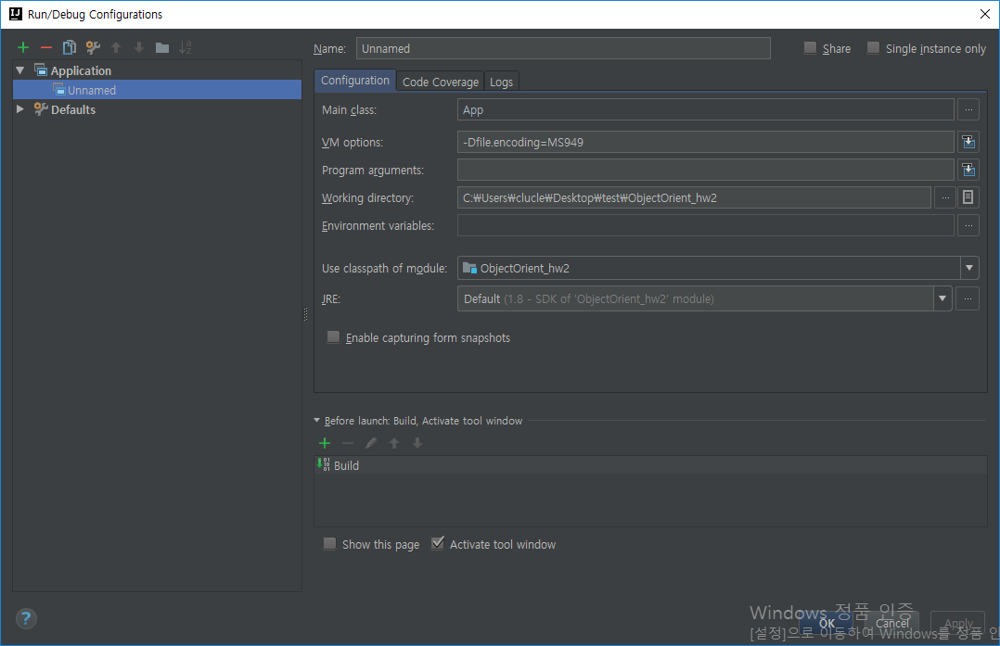
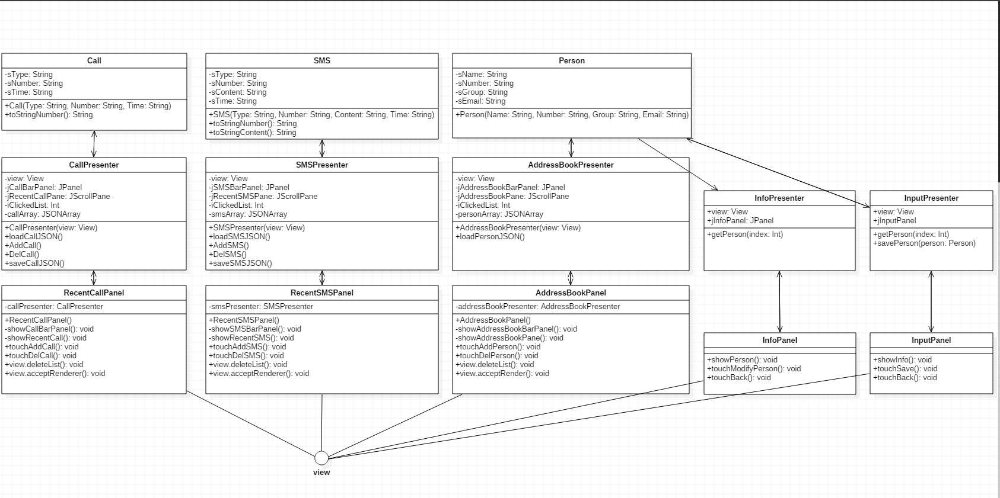

# IntelliJ에서 실행하기 - 한국어

1. IntelliJ에서 프로젝트를 불러온다

2. Run/Debug Configurations에 들어간다

3. 위의 +버튼 눌러서 Apllication 추가

4. Main class 에 App class 추가

5. VM options에 -Dfile.encoding=MS949 추가

--

# Running on IntelliJ - English

1. Open a project from IntelliJ

2. Enter Run / Debug Configurations

3. Press the + button above to add Aplication

4. Add App class to main class

5. Add -Dfile.encoding = MS949 to VM options

--

# Run/Debug Configurations Setting

--

# UML

